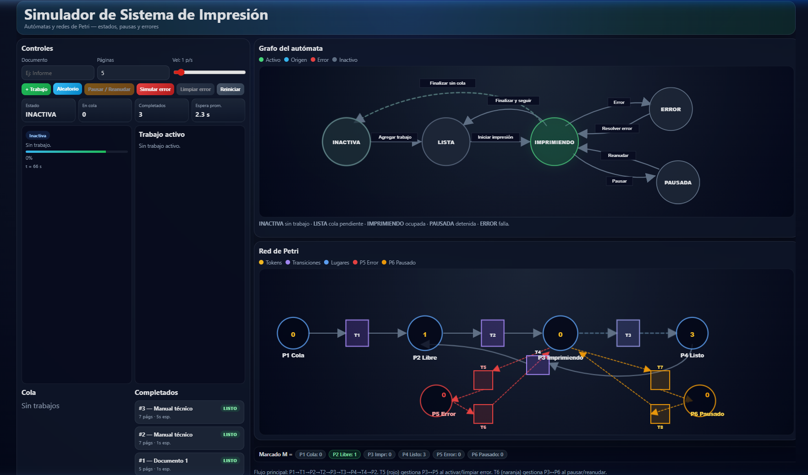
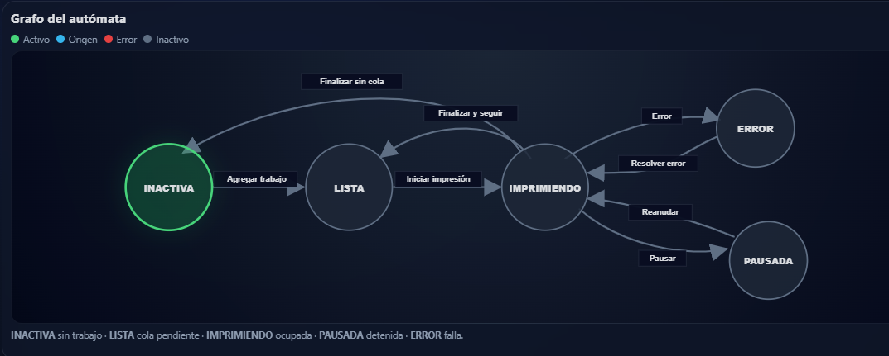
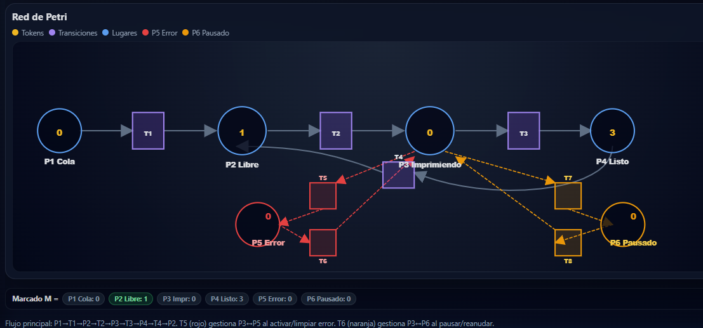

<div align="center">
  

  # 🖨️ Simulador de Sistema de Impresión
  
  **Teoría y Aplicación de Autómatas y Redes de Petri**

  [](https://es.wikipedia.org/wiki/HTML5)
  [](https://es.wikipedia.org/wiki/CSS3)
  [](https://developer.mozilla.org/es/docs/Web/JavaScript)
  [](https://www.docker.com/)

</div>

---

## 📖 Descripción del Proyecto

Este proyecto es un simulador interactivo de un sistema de impresión que gestiona una cola de trabajos. Desarrollado como parte de la asignatura de **Teoría de Autómatas y Lenguajes Formales**, tiene como objetivo principal demostrar cómo la computación formal permite modelar sistemas de eventos discretos con alta precisión matemática.

El motor de simulación se basa en la integración de dos modelos fundamentales:
- **Autómatas Finitos (Máquinas de Estado):** Para controlar el ciclo de vida general del sistema (Inactiva, Imprimiendo, Pausada, Error).
- **Redes de Petri:** Para gestionar de manera estricta el control de concurrencia, sincronización de eventos y el flujo de los recursos, asegurando que no ocurran estados imposibles (como imprimir dos trabajos al mismo tiempo con un solo cabezal).

---

## ✨ Características Principales

- 🚦 **Gestión de Estados Compleja:** Simulación en tiempo real de transiciones lógicas (IDLE, READY, PRINTING, PAUSED, ERROR).
- 📊 **Representación Matemática Interna:** Funciona con un motor que obedece estrictamente el flujo y marcado de tokens de una Red de Petri.
- 🎨 **Interfaz Gráfica Atractiva:** Monitoreo visual de la cola de impresión, el proceso actual y las estadísticas del sistema.
- 🐳 **Lista para Producción:** Incluye configuración de Docker (basada en Nginx Alpine) para un despliegue rápido y escalable.

---

## 🖼️ Interfaz del Simulador

*(La interfaz principal del sistema donde se observan la cola de trabajos y el estado de la máquina).*


*(Grafo de estados del Autómata finito que gobierna el simulador).*


*(Grafo y marcado de la Red de Petri implementada).*


---

## 🛠️ Tecnologías Utilizadas

- **Frontend:** HTML5, CSS3 (Vanilla), JavaScript (Vanilla, ES6+).
- **Despliegue:** Docker, Nginx Alpine.
- **Teoría Aplicada:** Teoría de la Computación, Autómatas Finitos Deterministas (DFA), Redes de Petri.

---

## 🚀 Instalación y Uso

El proyecto puede ser ejecutado localmente de manera tradicional o desplegado a través de contenedores.

### Opción 1: Ejecución Local

Dado que es un proyecto puramente frontend (Vanilla JS/HTML/CSS), no requiere dependencias pesadas ni la instalación de Node.js.

1. Clona este repositorio o descarga los archivos.
2. Abre el archivo `index.html` directamente en tu navegador web de preferencia.
3. ¡El simulador estará listo para usarse!

### Opción 2: Despliegue con Docker

El proyecto incluye un `Dockerfile` optimizado que levanta un servidor `nginx:alpine` para servir la aplicación.

1. Asegúrate de tener Docker instalado y corriendo.
2. Abre una terminal en la raíz del proyecto.
3. Construye la imagen de Docker:
   ```bash
   docker build -t simulador-impresion .
   ```
4. Ejecuta el contenedor exponiendo el puerto 80 (o el de tu elección, por ejemplo `8080`):
   ```bash
   docker run -d -p 8080:80 --name mi-simulador simulador-impresion
   ```
5. Abre en tu navegador `http://localhost:8080`.

---

## 👥 Equipo de Desarrollo

Este simulador fue diseñado e implementado por los estudiantes del programa de Ingeniería de Sistemas de la Universidad de Cartagena:

- **Jorge Sierra Morales**
- **Haider Lopez Guerrero**
- **Sebastián Vargas Leones**

*Bajo la tutoría del docente Luis Tovar Garrido (Mayo, 2026).*
